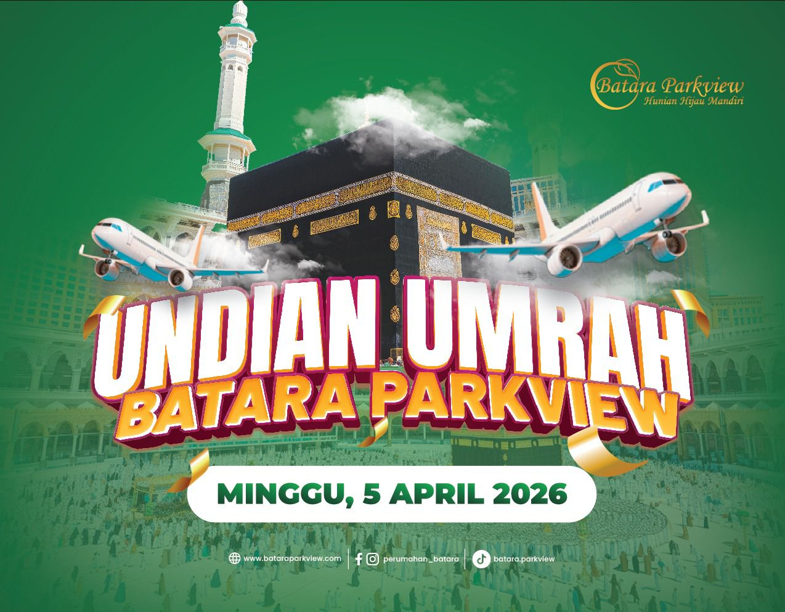

# 🕌 Umrah Lucky Draw - Batara Parkview Edition

A premium, cinematic, and high-impact web application designed for live Umrah lucky draw events. This application provides a stunning "Golden Orb" visualization, real-time winner management, and immersive animations to create a memorable experience for participants.



## ✨ Key Features

- **Cinematic Golden Orb**: A mesmerizing focal point for the lucky draw with rotating rings and a glowing core.
- **Single Page Experience**: Optimized for professional displays and projectors with a locked, non-scrolling "Software-style" layout.
- **Adaptive Responsiveness**: Works perfectly on Desktops (Locked Mode) and Mobile devices (Smart Scroll Mode).
- **Airplane Animations**: Thematic airplanes periodically fly across the background, enhancing the pilgrimage atmosphere.
- **Luxurious Winner Pop-up**: High-impact winner announcements with gold gradients, luminous rings, and canvas confetti celebrations.
- **Real-time Data Management**: Built-in participant management system to add, edit, or remove names on the fly.
- **Sound Integration**: Immersive sound effects for the drawing process and victory announcements.
- **Fullscreen History**: A dedicated, large-scale view for displaying the complete list of winners to the audience.

## 🛠️ Technology Stack

- **HTML5**: Semantic structure with modern metadata.
- **Vanilla CSS**: Custom design system with glassmorphism, advanced animations, and responsive breakpoints.
- **JavaScript (ES6+)**: Core logic, state management, and DOM manipulation.
- **Lucide Icons**: Crisp, vector-based iconography.
- **Canvas Confetti**: High-performance particle celebrations.
- **Web Audio API**: Real-time sound synthesis and playback.

## 🚀 Getting Started

1. **Clone the repository**:
   ```bash
   git clone https://github.com/your-username/umrah-lucky-draw.git
   ```
2. **Open `index.html`**: Simply open the file in any modern web browser (Chrome, Edge, or Safari recommended).
3. **Manage Participants**: Click the **Database Icon** next to the main title to input your participant list.
4. **Start Drawing**: Set the number of winners and click **MULAI PENGACAKAN**.

## ⚙️ Customization

- **Background**: Replace `background.jpeg` with your own event-themed image.
- **Colors**: Modify the primary gold/amber values in `style.css` to match your branding.
- **Sound**: Swap `Award Sound Effect.mp3` for a custom victory anthem.

## 📄 License

This project is open-source and available for customization. Created with ❤️ for Batara Parkview - MARCOM BPG.
